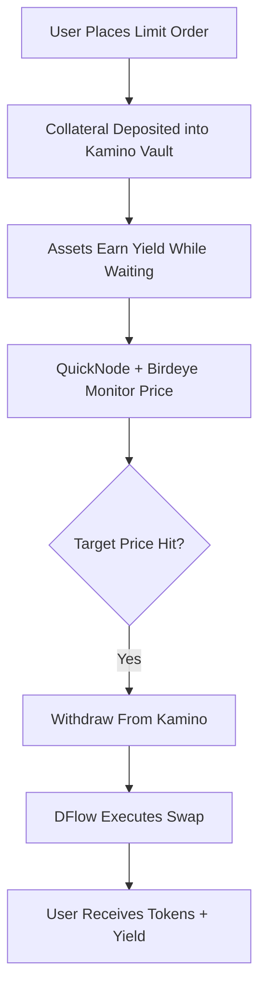

# YieldPark 🌊💸

> **Limit orders that earn yield while they wait.**

[](https://yieldpark.vercel.app/)
[](https://solana.com/)
[](LICENSE)

YieldPark is a Solana-native DeFi protocol that transforms idle limit order capital into yield-generating positions.

Instead of locking funds in inactive order books, YieldPark automatically deploys user collateral into Kamino vaults while waiting for execution. Once the target price is reached, the protocol atomically withdraws funds and executes the trade via DFlow with MEV-protected routing.

---

# 🌐 Live Demo

### 🔗 https://yieldpark.vercel.app/

---

# 🚀 The Problem

Traditional DEX limit orders are capital inefficient.

When traders place a limit order:

- funds remain idle,
- capital earns no yield,
- liquidity sits unused,
- and users lose opportunity cost while waiting.

Across DeFi, billions of dollars remain locked in inactive order books generating zero return.

---

# 💡 The Solution

YieldPark introduces:

## **Yield-Generating Limit Orders**

While a limit order waits for execution:

1. User collateral is deposited into Kamino vaults
2. Assets continuously earn yield
3. Birdeye + QuickNode monitor market prices in real-time
4. When target conditions are met:
   - funds are atomically withdrawn,
   - swapped through DFlow,
   - and settled directly to the user wallet

The user receives:

✅ Executed trade  
✅ Yield earned during waiting period  
✅ MEV-protected execution  
✅ Capital-efficient trading

---

# 🏗️ Core Flow



---

# 🤝 Ecosystem Integrations

| Partner | Integration | Purpose |
|---|---|---|
| **DFlow** | MEV-Protected Swap Execution | Secure trade routing and execution |
| **Kamino Finance** | Yield Vault Deposits | Earn yield while orders wait |
| **Birdeye** | Real-Time Price Feeds | Trigger monitoring and analytics |
| **QuickNode** | RPC + Streams | Reliable infrastructure and live order watching |
| **Solflare** | Wallet Integration | Smooth Solana-native user experience |

---

# ✨ Features

## 📈 Yield While Waiting
Idle collateral automatically generates passive yield.

## ⚡ Atomic Execution
Single transaction:
- withdraws from Kamino,
- executes swap,
- settles to wallet.

## 🛡️ MEV Protection
Trades routed securely through DFlow execution infrastructure.

## 📊 Real-Time Analytics
Integrated Birdeye price data and trading insights.

## 🎨 Premium UX
Built with a modern Solana DeFi interface:
- dark mode,
- glassmorphism,
- animated yield counters,
- responsive dashboard.

---

# 🖥️ Product Screens

## Landing Page
- Hero section
- YieldPark protocol explanation
- Live protocol statistics

## Order Placement
- Token pair selection
- Limit price input
- APY estimation
- Expected yield preview

## Active Orders Dashboard
- Live yield tracking
- Time elapsed
- Current market price
- Execution status

## Portfolio Analytics
- Lifetime yield earned
- Filled orders
- Capital efficiency metrics
- Historical performance

---

# 🧠 Why YieldPark Matters

YieldPark improves:

- capital efficiency,
- liquidity utilization,
- passive yield generation,
- and overall DeFi trading UX.

This creates a new primitive for decentralized trading:

> **Yield-bearing execution infrastructure.**

---

# ⚙️ Tech Stack

## Frontend
- Next.js
- TypeScript
- TailwindCSS
- Framer Motion
- shadcn/ui

## Blockchain / Solana
- Solana Web3.js
- Anchor Framework
- SPL Tokens
- Wallet Adapter

## Integrations
- Kamino SDK
- DFlow APIs
- Birdeye APIs
- QuickNode RPC + Streams
- Solflare Wallet Adapter

---

# 🔥 Key Innovation

YieldPark is not just another trading UI.

It combines:

- yield farming,
- limit order execution,
- MEV protection,
- and automated capital deployment

into a single seamless user experience.

No major Solana protocol currently offers:

> **Limit orders that continuously earn yield before execution.**

---

# 📊 Example Scenario

```text
Buy 10 SOL when SOL < $120
↓
1000 USDC deposited into Kamino vault
↓
USDC earns yield while waiting
↓
Price condition triggered
↓
Atomic withdrawal + DFlow swap execution
↓
User receives:
- 10 SOL
- accumulated yield
```

---

# 🛣️ Future Roadmap

## Phase 1
- Core limit order engine
- Kamino yield integration
- DFlow execution layer
- Solflare wallet support

## Phase 2
- Multi-vault yield optimization
- Advanced order types
- Stop-loss orders
- Dynamic APY routing

## Phase 3
- Cross-margin strategies
- AI-assisted execution
- Mobile trading support
- Institutional APIs

---

# 🧪 Local Development

## Clone Repository

```bash
git clone https://github.com/zcsaqueeb/YieldPark.git
cd YieldPark
```

## Install Dependencies

```bash
npm install
```

## Run Development Server

```bash
npm run dev
```

Open:

```text
http://localhost:3000
```

---

# 🔐 Environment Variables

Create a `.env.local` file:

```env
NEXT_PUBLIC_SOLANA_RPC_URL=
NEXT_PUBLIC_BIRDEYE_API_KEY=
NEXT_PUBLIC_DFLOW_API_KEY=
NEXT_PUBLIC_QUICKNODE_URL=
```

---

# 📦 Deployment

YieldPark is deployed on:

- Vercel
- Solana Devnet

---

# 🏆 Hackathon Vision

YieldPark was designed for the Solana ecosystem with a focus on:

- meaningful partner integrations,
- real onchain activity,
- production-quality UX,
- and long-term protocol viability.

---

# 👥 Team

Built with ❤️ for the Solana ecosystem.

---

# 📜 License

MIT License

---

# 🌊 YieldPark

### *Your limit orders should work for you — even while waiting.*
